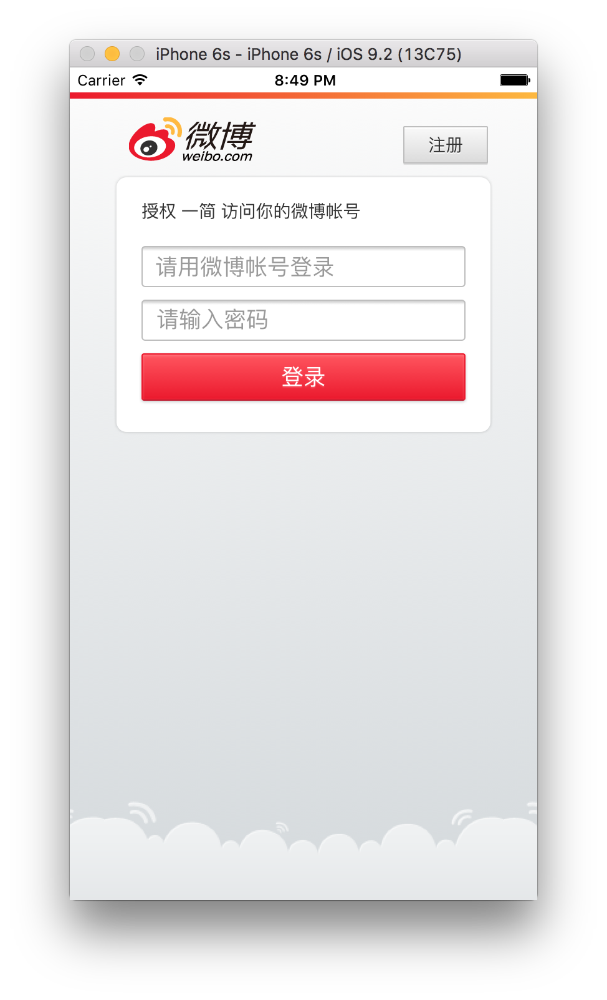
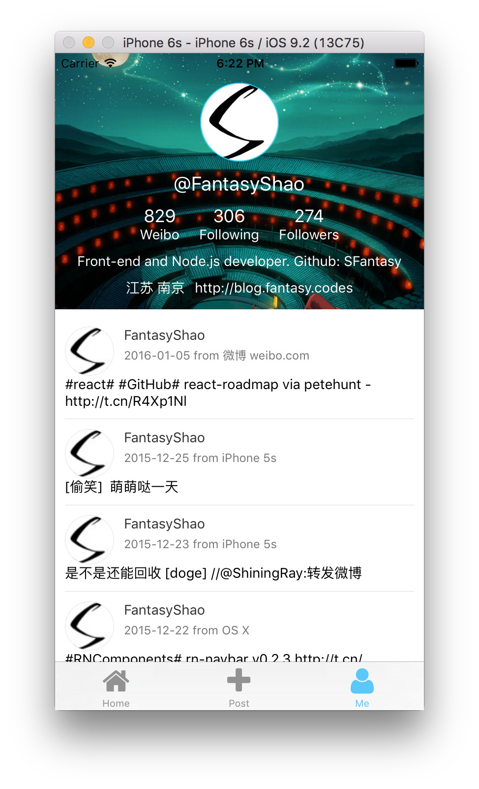

一简
---

[README in English](README_en.md)

> 开发中, 欢迎 watch, star && fork

一款使用react-native开发的微博客户端

## 开发

### 依赖版本

- Node.js v4.0+
- ReactNative v0.18.0-rc

### 运行

- `git clone git@github.com:SFantasy/WeiboReactNative.git`
- 执行 `cd WeiboReactNative && npm install`
- 将 `config.example.js` 中的 `app_key` 和 `app_secret` 修改为你自己申请的, 并将文件重命名为 `config.js`
- 在 XCode 中打开 `Yijian.xcodeproj`
- Command + R

### 在设备上运行

- 执行 `npm run bundle` 生成打包的JS文件
- Command + R

## 截屏

- 登录 (OAuth)

- 时间轴

- 个人主页

## 使用的开源组件

- [react-native-vector-icons](https://github.com/oblador/react-native-vector-icons)
- [react-native-spinkit](https://github.com/maxs15/react-native-spinkit)
- [react-native-gifted-listview](https://github.com/FaridSafi/react-native-gifted-listview)

## License

The [BSD License](LICENSE)
